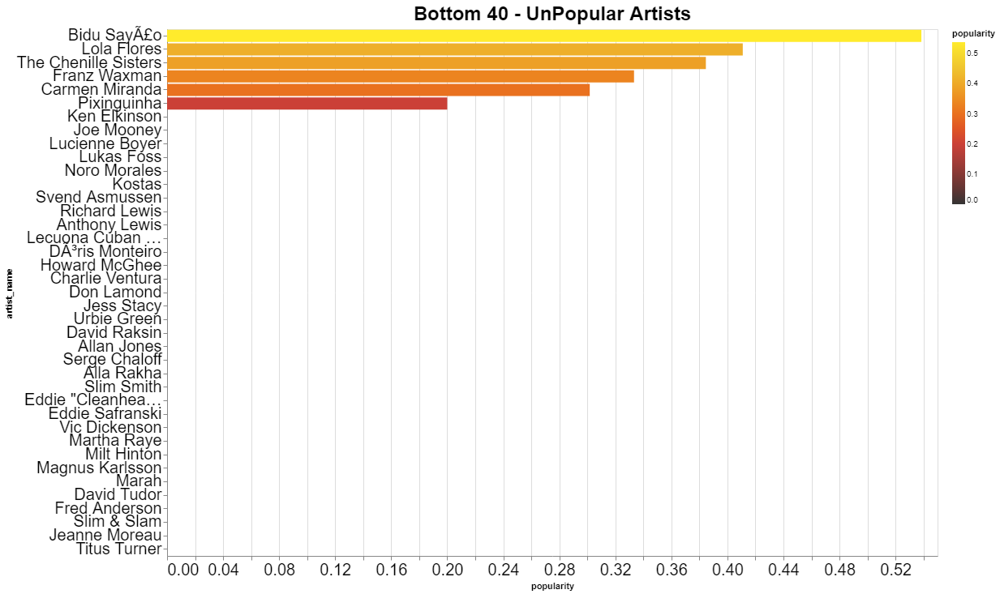
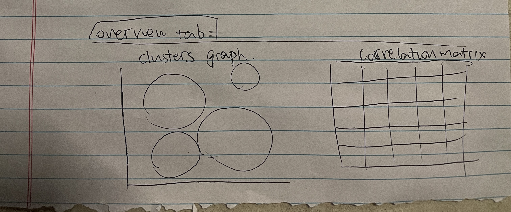

# Final Project Proposal

**GitHub Repo URL**: https://github.com/CMU-IDS-Fall-2023/final-project-musicmagicians/tree/main

**A short summary (3-4 paragraphs, about one page) of the data science problem you are addressing and what your solution will address. Feel free to include a figure or sketch to illustrate your project.**

Complete Project proposal: https://docs.google.com/document/d/12_InTimLdOuIm3lGfAHxmgSYuEV3K-SWiDrrchgJ_KY/edit?usp=sharing

Music has been an integral part of human societies for centuries. To understand how music has influenced the collective human experience, we will use a music dataset from Interdisciplinary Contest in Modeling (ICM) problem D in 2021. Our goal is to visualize the evolution of music from different perspectives, such as artist influence and genre evolution. This dataset can be accessed from ICM’s official website. It consists of four sub-datasets that can be used to answer different questions, two of which are transformed from the ‘full_music_data.csv’ dataset by grouping by artist and year.

There are a number of potential questions we can answer from this dataset. We hope that these questions can help us gain better insight into how mucis influences the collective human experience and how social events impact the evolution of music. Here're some initial questions we hope to answer:

1. How could we define “music influence”? By our definition, who are the most influential artists in music history? Could we find patterns of how one major genre influences the other? What are the relationships between top artists from 1921-2020?
2. What attributes distinguish a genre? How does each genre/artist evolve? 
3. How does the evolution of music attributes reflect the social, cultural, and technological climate?

There are a number of features that our appllication can have. At this phase of the project, we plan to have hierarchical visualization of how different artists influence each other, a cluster that help visualize the similarity between different genres, and charts and graphs that correlate the most popular music genre and music charasteristic such as danceability with historical events. We will continue to add more and adjust our visualizations as we continue development to ensure we gain a deeper understanding of how music interacts with our daily lives and how music is affect by it. 

## Data Analysis
### Data Processing
No intensive data cleaning was required for any of the four files in the dataset: [data_by_artist.csv](https://drive.google.com/file/d/1GYkZtooVod1tjLVtspyj5hIKscgrwT3A/view?usp=drive_link), [data_by_year.csv](https://drive.google.com/file/d/1VNsPy8SULOoqx1Qgld_2jy71ydg-5JmC/view?usp=drive_link), [full_music_data.csv](https://drive.google.com/file/d/1liddTqjRu9usKtlZJCVGvX6Dvx4DkFqu/view?usp=drive_link) and, [influence_data.csv](https://drive.google.com/file/d/1XKSUEbTpLmKWU4b9qALVsdFZ40w0Uyit/view?usp=drive_link) as there weren't any malformed columns or NULL data present. However, upon closer inspection, we did find some processing and cleaning required for the [data_by_artist.csv](https://drive.google.com/file/d/1GYkZtooVod1tjLVtspyj5hIKscgrwT3A/view?usp=drive_link) and [full_music_data.csv](https://drive.google.com/file/d/1liddTqjRu9usKtlZJCVGvX6Dvx4DkFqu/view?usp=drive_link) files. For the former, data reconfiguration was required to suit our needs and the latter required cleaning hidden duplicated data.

The full details of the Exploratory Data Analysis conducted can be found in the notebooks in the [eda_notebooks](./eda_notebooks) folder. The detailed cleaning methods and re-configuration steps applied to each file is described below.

#### Data Cleaning
1. In the [data_by_artist.csv](https://drive.google.com/file/d/1GYkZtooVod1tjLVtspyj5hIKscgrwT3A/view?usp=drive_link) file, while all the values in the artist_id columns were distinct, the associated column values were the same. That is, the same artist was assigned multiple artist_id values. This duplication was discovered by running a profiler and inspecting the report. Subsequently, the 41 artists for whom the data was duplicated were cleaned to keep the first data instance. This changed the number of data points from 5854 rows × 16 columns to 5810 rows × 16 columns. Please look into the [EDA_data_by_artist.ipynb](./eda_notebooks/EDA_data_by_artist.ipynb) notebook to review the entire EDA process with profiling, cleaning and visualizations. The cleaned data file was saved as [cleaned_data_by_artist.csv](https://drive.google.com/file/d/1bJRKXG0wm7QNhmXMgQ7U1HQEzgYl0EAU/view?usp=drive_link).

2. There was some processing to be done in the [full_music_data.csv](https://drive.google.com/file/d/1liddTqjRu9usKtlZJCVGvX6Dvx4DkFqu/view?usp=drive_link) file. More specifically, the type of the artist_name column is string, where it should be a list. However, naively splitting the string with "," is tricky because some artists, such as bands, use comma in their name. This will cause discrepancy between artist name and artist id column, making it impossible to explode the dataset. One method to get around this is to convert the id column into list of ints, and use the data by artist dataset to map back the artist name from the id. 

Additionally, we performed some EDA on all four tables and a subset of our plots from EDA are shown below.

#### Deriving Data for the Dashboard and More Data Integration
For our proposed dashboard components, we have the required data to visualize rich and interactive charts post data cleaning and re-configuration. We might additionally encode geographical information from online sources and merge the main_genre column from the [influence_data.csv](https://drive.google.com/file/d/1XKSUEbTpLmKWU4b9qALVsdFZ40w0Uyit/view?usp=drive_link) into the [cleaned_data_by_artist.csv](https://drive.google.com/file/d/1bJRKXG0wm7QNhmXMgQ7U1HQEzgYl0EAU/view?usp=drive_link) file for visualizing geo-spatial artist musical influence.

### Full music dataset visualizations

#### Data by Year

 
This plot displays the correlations between all columns in the dataset. We can observe that year is strongly negatively correlated with certain music characteristics like acousticness and instrumentalness and positively correlated energy and loudness, but less strongly so.
 
 

 
Although years are not taken into acount in these histograms, we can get a sense of the distribution of these features in music over the past century. For the features on a decimal scale, larger values indicate a higher confidence in the presence of that feature and lower values indicate unlikeliness in the presence of that feature.
 
 

 
We observed in the correlation matrix that acousticness and energy were strongly negatively and positively correlated with year, so we plotted both features on the same graph to observe the magnitude and direction of both relationships. Interesting to note is that both features experienced rapid changes starting at around 1950 and leveling off in 1980.
 

### Data by artist

The data contained in the dataset used to construct the following charts was [cleaned_data_by_artist.csv](https://drive.google.com/file/d/1bJRKXG0wm7QNhmXMgQ7U1HQEzgYl0EAU/view?usp=drive_link). A point to note is that the data in this file only documents popularity for artists from 1921 to ~2008 and not 2020 which explains why the most popular and unpopular artists from the charts do not reflect the current status. Furthermore, the charts for this file were built using vega-altair. So, if you would like to see the interactive version of the charts with tooltips, please navigate to the [notebooks](eda_notebooks).
 

 
This chart ranks the Top 25 most popular artists in the dataset based on the popularity score. While <strong>El Guincho</strong> is the most popular artist based on popularity score, some familiar names like <strong>Billie Eilish</strong>, <strong>Camila Cabello</strong> and, <strong> Harry Styles</strong> also make the rankings.
 
 

 
This chart ranks the Bottom 40 - unpopular artists in the dataset based on the popularity score. Since the chart displays the rankings in descending order of rankings, the unpopular artists is are at the bottom of the chart. 33 artists have a popularity score of 0. They have no bars in the chart.
 
 

 
To understand the all the relationships between features in the dataset, a multi-scatter plot was generated. The chart was useful in visualizing the overall distribution of the points for the specific features.
 
 

 
Lastly, a heatmap to cross-highlight the relationship between energy, loudness and popularity was constructed. Loudness is highly correlated to popularity, closely followed by energy. The binned heatmap reveals the combination of loudness and energy values with high popularity scores. An overlay plot of energy and loudness was plotted to visualize the relationship between them.
 

### Influence data

 
We plot the career start of influencers and followers side-by-side. As shown in the influencer graph, number of influencers reaches a peak around 1960. As shown in the follower graph, number of followers surges around 1990. The lag is reasonable given the influencer-follower dynamic. One surprising aspect is that there is a gap from 1960-1970 in both graphs. Whether this is due to data collection issue or social issue is up to further investigation.
 

 
We plot the distribution of main genres for influencers and followers side-by-side. As shown above, "Pop/Rock" is the most popular genre for both influencers and followers, followed by "R&B", "Country", and "Jazz". For the influencers, the 5th popular genre is "Vocal", while for the followers, it's "Electronic". From this graph, we could also see that the genres are distributed unevenly with a majority class and several minority classes. This indicates in network visualization, we need to pay attention to the number of genre upper bound.

 

 
We plot a horizontal bar plot of the artists sorted by their number of followers. As shown above, the Beatles is a dominant top artist with more than 600 followers, followed by Bob Dylan, the Rolling Stone, etc.
 

## Sketches and System design
    
We will have one static dashboard page where the use can view the original four datasets. This will be out home page. We propose to have four pages that contains visualizations and interactions for each dataset.

### Full music dataset 
In this page, we plan to implement three tabs in this page. The user can click on one tab and contents in other tabs will be invisible. This is our design decision because we don't want to crowd the page with too many information, visualizations, and interactions.

1. Overview tab: This tab will show the distribution of different features in the dataset such as danceability, valence, acousticness. We want to show some statistical information about the dataset for the user to get some high-level understanding of the dataset.

2. Songs rank tab: This tab will allow the users to input the desiged range of years to filter from, number of songs to show, and show the users the most or least popular songs in the desired year range. 

3. Compare songs tab: This tab will allow the user to search for two songs and plot two polar graphs for the two songs side by side. This can provide the user to look at songs of their choosing in more detail.

### Data by year
In this page, we aim to examine how cultural changes and advancements in music technology is reflected in our dataset. This dataset consists of aggregated/averaged characteristics of music created in that year; we aim for this page to be more of an educational one rather than one centered around interactivity.

1. The Rise of Electronic Music
   We observe a strong negative relationship when we plot energy against acousticness and instrumentalness. Starting in the 1950s with the introduction of electronic augmentation, we can visually discern how quickly it takes over. This plot is meant to be a line graph.
2. Faster, Louder, More Explicit
    This area chart will plot loudness, tempo, and explicitness in one area chart. The challenge of this graph will be working with 3 distinct axes and conveying the context of the axes to the audience without being too confusing.
4. G-Major and C-Major Rule All Other Keys
   We observed that the dominant keys over the past century are G-Major and C-Major, which is somewhat common knowledge in the music community. We will display this information in a smaller pie chart to break up the format of the page.
5. Custom Line or Area Graph Creation (Not shown in sketch)
   We will add one last graph at the bottom of the page where the user can customize the date range they want to see information from, which characteristics they want to plot, and whether they prefer to have the plot as a line or an area chart. For the sake of generalizability, we will limit the available traits for this graph to be the characteristics on a 0-to-1 scale.
   

### Data by artist

In this page, we aim to include artist specific information in the visualizations in separate tabs:
1. <strong>Single-artist statistics and summarize the data visually</strong>: this information is encoded for the song characteristics features danceability, energy, valence, tempo, loudness, acousticness, instrumentalness, liveness and, speechiness through a <strong>Radar Chart</strong> along with other artist-specific summary statistics (interactivity through drop-down list of artists or search)
2. <strong>Compare two artists side-by-side</strong>: compare two artists using the above radar chart and summary statistics by interacting with a drop-down list of artists or search
3. <strong>Artist ranking based on popularity scores (stacked with song characteristics)</strong>: rank the top and bottom k artists through a <strong>Stacked Bar Chart</strong> of features where k is chosen by the user using a count picker
4. <strong>Geo-spatial spread and influence of artists around the world (optionally, upon integrating data)</strong>: upon integrating genre and geopraphical data to the file, a <strong>World Artist Distribution and Influence</strong> map can be created, where genre can be encoded through colors or can be an interactive selection by the user

While a [preliminary plan](./eda_notebooks/sketches/dashboard-sketches-artist-ideas-planning.pdf) of what type of charts would be useful to encode these relationships is presented, we may choose to modify or add components to best represent our data.

### Influence data

1. Filtering: This step will feature one year slider and one number input to focus on data of interest specified by the users. In particular, since our influence data spans from 1930 to 2010, and includes 5854 unique artists, the information will overflow if we include all in a single visualization. Thus, we give users their options to focus on specific periods and a selection of artists.
2. Artist Network: In influence dataset, each row includes an influencer and his/her follower. This ordered structure naturally induces a directed network of artists, where each node represents an artist, and each outgoing edge indicating the influence. Following the previous selection step, we will visualize a network consisting of top n artists along with their influences on each other.
3. Genre Network: This step will focus on a larger granularity- influence on the genre level. Similar to step 2, we will incorporate a number input box for number of genres and visualize a relationship graph consisting of top n genres. This will facilitate our understanding of how genres impact each other.

